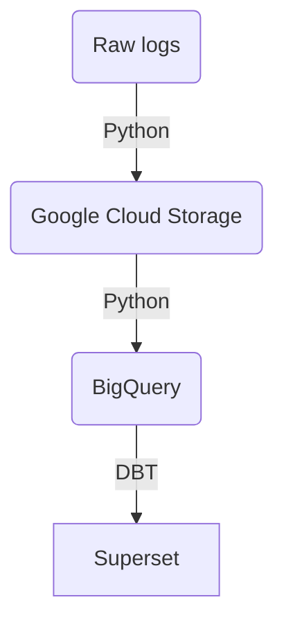

# Final Data Engineer Zoomcamp Project
This project includes codes for an end-to-end data pipeline.

## Information
- Data: [Github Archive](https://www.gharchive.org/)
- Data ingestion: Python & Pandas
- Data transformation: DBT
- Orchestration: Prefect
- BI tool: Superset


## Install

- Create virtual env:
```
python -m venv venv
source venv/bin/activate
pip install -r requirements.txt
```

### Setup prefect
#### Run prefect
```
prefect server start
prefect agent start -p default-agent-pool
```
#### Create blocks
- Register GCP prefect block: 
```
prefect block register -m prefect_gcp
```
- Create essential blocks: GCP Credentials, GCP Bucket
#### Deploy flows: 
- Ingestion:
```
cd ingestion/app
prefect deployment build -n etl_data_to_big_query etl:etl_data_to_big_query --apply
```
 - DBT:
    + Edit `project_dir` and `profiles_dir` values on file [dbt.py](ingestion/app/dbt.py) to folder transformation/gh_archive and dbt profile folder, respectively.
    + Deploy:
```
cd ingestion/app
prefect deployment build -n trigger_dbt_transformation dbt:trigger_dbt_transformation --apply
```

### Install and run Superset
- [Install docker first](https://docs.docker.com/engine/install/)
- Install Superset: check out folder [dashboard](dashboard), it will be started at port 8088
  
  